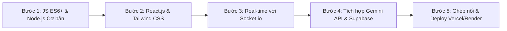

# HƯỚNG DẪN KỸ THUẬT & LỘ TRÌNH PHÁT TRIỂN DỰ ÁN
## Dự án: Real-time Collaborative AI Study Platform

---

## 1. DÁNH SÁCH NGÔN NGỮ & CÔNG NGHỆ CẦN DÙNG (TECH STACK)

### 1.1 Ngôn ngữ Lập trình Cốt lõi
* **JavaScript (ES6+) / TypeScript:** Ngôn ngữ duy nhất sử dụng cho cả Frontend và Backend.
  * *Kiến thức trọng tâm cần nắm:* `Async/Await`, `Promises`, `Arrow Functions`, `Destructuring`, `Array Methods (map, filter, reduce)`, `JSON Parsing`.

### 1.2 Frontend (Giao diện Web)
* **React.js (khởi tạo bằng Vite):** Thư viện dựng giao diện người dùng theo component.
* **Tailwind CSS + Shadcn UI:** Bộ thư viện thiết kế giao diện hiện đại, chuẩn SaaS.
* **React Flow:** Thư viện vẽ sơ đồ tư duy (Mindmap) từ dữ liệu dạng cây của AI.
* **react-pdf / pdfjs-dist:** Thư viện hiển thị tệp slide PDF mượt mà trên trình duyệt.
* **socket.io-client:** Thư viện lắng nghe và gửi tín hiệu đồng bộ thời gian thực tới máy chủ.

### 1.3 Backend (Máy chủ Xử lý)
* **Node.js:** Môi trường chạy JavaScript trên máy chủ.
* **Express.js:** Framework dựng Web API đơn giản, xử lý nhận/gửi dữ liệu.
* **Socket.io (Server):** Máy chủ quản lý các phòng học (Rooms) và đồng bộ slide/quiz thời gian thực.
* **pdf-parse:** Thư viện bóc tách dữ liệu chữ từ tệp PDF slide.
* **@google/genai:** SDK chính thức kết nối với Google Gemini API.

### 1.4 Cơ sở Dữ liệu & Lưu trữ (Cloud Services - Miễn phí)
* **Supabase (PostgreSQL):** Lưu trữ thông tin người dùng, danh sách phòng, ngân hàng câu hỏi.
* **Supabase Storage:** Lưu trữ tệp tin slide PDF/PPTX người dùng tải lên.
* **Google AI Studio (Gemini 1.5 / 2.0 Flash API):** Trí tuệ nhân tạo sinh câu hỏi, vẽ mindmap và hỏi đáp RAG.

### 1.5 Nền tảng Deploy (Miễn phí 100%)
* **Vercel:** Hosting công khai cho Frontend React.
* **Render.com / Koyeb:** Hosting công khai cho máy chủ Backend Node.js + Socket.io.

---

## 2. LỘ TRÌNH KIẾN THỨC CẦN HỌC (STEP-BY-STEP LEARNING ROADMAP)

Để xây dựng hoàn chỉnh ứng dụng này, bạn nên học theo 5 bước lũy tiến dưới đây:



### Bước 1: Nền tảng JavaScript & Node.js Express cơ bản
* Học cú pháp JavaScript hiện đại: `async/await`, cách làm việc với mảng/object.
* Học cách tạo một máy chủ Express đơn giản với các API `GET`, `POST`.
* Học cách làm việc với tệp tin: đọc file PDF bằng `pdf-parse`.

### Bước 2: Frontend với React.js & Tailwind CSS
* Học tư duy Component trong React (`useState`, `useEffect`, `useRef`).
* Học cách gọi API từ Backend lên Frontend bằng `fetch` hoặc `axios`.
* Học sử dụng Tailwind CSS để dựng giao diện cơ bản (Button, Input, Sidebar, Modal).

### Bước 3: Xử lý Thời gian thực với Socket.io (Quan trọng nhất)
* Học cách tạo kết nối Socket giữa Client và Server.
* Học khái niệm **Phòng (Rooms)** trong Socket.io: `socket.join(roomCode)`.
* Học cách gửi dữ liệu cho một phòng: `io.to(roomCode).emit('event_name', data)`.

### Bước 4: Gọi API AI (Gemini) & Quản lý Database (Supabase)
* Học cách tạo API Key trên Google AI Studio.
* Học cách tạo Prompt chuẩn để Gemini trả về định dạng **JSON Structured Output**.
* Học cách tạo bảng (Tables) trên Supabase và gọi SDK để thêm/sửa/xóa dữ liệu.

### Bước 5: Ghép nối Dự án & Đưa lên Web (Deployment)
* Đưa code Frontend và Backend lên **GitHub**.
* Kết nối Vercel với Frontend repo ➔ Cài đặt Biến môi trường ➔ Deploy.
* Kết nối Render với Backend repo ➔ Cài đặt Biến môi trường ➔ Deploy.

---

## 3. DANH SÁCH CHI TIẾT CÁC CHỨC NĂNG CẦN PHÁT TRIỂN (FEATURE CHECKLIST)

### 🟢 Phân hệ 1: Quản lý Người dùng & Phòng học (Auth & Rooms)
- [ ] **Đăng nhập / Đăng ký:** Tạo tài khoản bằng Supabase Auth.
- [ ] **Tạo phòng học:** Chủ phòng nhập tên phòng ➔ Hệ thống sinh mã Room Code 6 số.
- [ ] **Tham gia phòng:** Người dùng nhập mã Code hoặc quét mã QR ➔ Tham gia vào phòng.
- [ ] **Phòng chờ (Lobby):** Hiển thị danh sách Avatar/Tên các thành viên đang Online.

### 🟡 Phân hệ 2: Xử lý Slide & Tích hợp AI (RAG Engine)
- [ ] **Upload Slide:** Người dùng kéo thả file PDF ➔ Lưu file vào Supabase Storage.
- [ ] **Bóc tách nội dung:** Backend dùng `pdf-parse` đọc chữ từng trang slide.
- [ ] **Sinh Quiz bằng AI:** Gửi văn bản slide cho Gemini API ➔ Nhận bộ câu hỏi trắc nghiệm dạng JSON.
- [ ] **Sinh Mindmap bằng AI:** Gemini API trả về cấu trúc cây ➔ Render ra sơ đồ bằng `React Flow`.
- [ ] **Chat RAG với Slide:** Nhập câu hỏi ➔ AI tìm đúng trang slide chứa đáp án và trả lời.

### 🔵 Phân hệ 3: Trình chiếu & Đồng bộ Tương tác (Workspace & Live Sync)
- [ ] **Viewer Slide:** Render file PDF mượt mà trên web.
- [ ] **Sync Slide:** Chủ phòng lật trang ➔ Gửi socket event `SLIDE_CHANGE` ➔ Màn hình thành viên tự động lật theo.
- [ ] **Con trỏ Laser:** Chủ phòng di chuột ➔ Gửi tọa độ `(x, y)` qua Socket ➔ Hiển thị chấm laser trên màn hình thành viên.
- [ ] **Sticky Note chung:** Người dùng thêm note ➔ Lưu vị trí và hiển thị real-time cho cả phòng.

### 🔴 Phân hệ 4: Thi đấu Quiz Thời gian thực (Gamified Battle)
- [ ] **Kích hoạt Quiz:** Chủ phòng chọn bộ câu hỏi ➔ Bấm "Bắt đầu Thi đấu".
- [ ] **Đếm ngược thời gian:** Máy chủ đếm ngược (ví dụ 15s) và phát tín hiệu cho tất cả người chơi.
- [ ] **Nhận đáp án & Chấm điểm:** Người chơi bấm chọn đáp án ➔ Máy chủ chấm điểm dựa trên Độ chính xác + Tốc độ.
- [ ] **Bảng xếp hạng Sống (Live Leaderboard):** Hiển thị danh sách Top điểm cao sau mỗi câu hỏi.
- [ ] **Tổng kết trận đấu:** Vinh danh Top 3 và hiển thị biểu đồ các câu hỏi nhiều người làm sai nhất.

---

## 4. GỢI Ý CẤU TRÚC THƯ MỤC DỰ ÁN (PROJECT STRUCTURE)

Dự án nên chia làm 2 thư mục độc lập để dễ phát triển và deploy:

```text
Real-time-Collaborative-AI-Study-Platform/
├── client/                     # REPO FRONTEND (REACT + VITE)
│   ├── src/
│   │   ├── components/         # Các thành phần UI (Button, Modal, Navbar...)
│   │   ├── pages/              # Trang Home, Trang Phòng học, Trang Quiz
│   │   ├── hooks/              # Custom hooks cho Socket.io, PDF viewer
│   │   ├── services/           # Gọi API Supabase, Backend REST API
│   │   └── App.jsx
│   └── package.json
│
├── server/                     # REPO BACKEND (NODE.JS + EXPRESS)
│   ├── src/
│   │   ├── controllers/        # Xử lý logic API (AI, File Parsing)
│   │   ├── sockets/            # Quan trọng: Quản lý sự kiện Socket.io (Sync slide, Quiz)
│   │   ├── services/           # Kết nối Gemini API, Supabase Admin
│   │   └── index.js            # Điểm chạy máy chủ Server
│   └── package.json
│
├── REQUIREMENTS.md             # Tài liệu Yêu cầu phần mềm
└── DEVELOPMENT_GUIDE.md        # File hướng dẫn này
```
